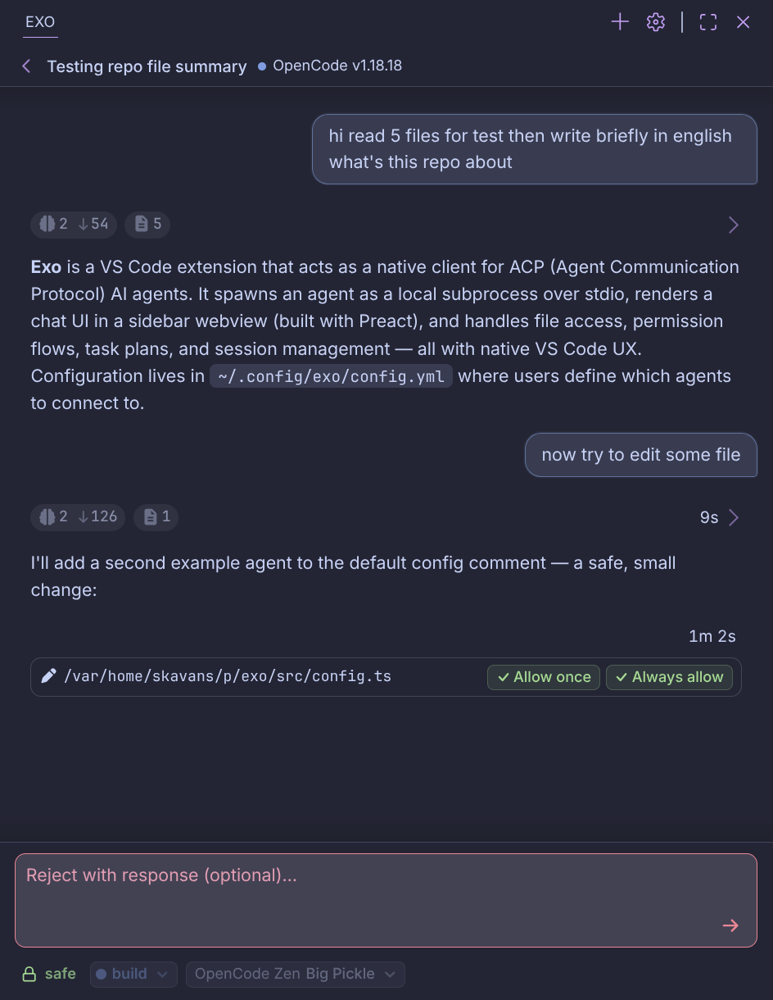

# Exo

<p align="center">
  
</p>

A VS Code extension that gives you a clean, native interface for talking to an
[ACP](https://agentclientprotocol.com/get-started/introduction) agent.

Exo is not an agent. It is a client: it spawns your agent as a child process
(via stdio/ACP), renders the conversation in the sidebar, and handles the
agent&#8217;s requests (file access, permissions, config, plans) with native VS Code
UX. The agent stays fully in control of its state, sessions, and history.

## Why a VS Code extension?

Because reading and writing code is much better in a human editor than in a TUI:

- Proper typography and readable, syntax-highlighted markdown.
- Code you can actually look at: hover, jump-to-definition, search, multiline diffs.
- Every file edit the agent makes lands in a **real diff editor** you can inspect
  and approve before it happens.
- One click on any mentioned path opens the file at the exact line.

Everything the agent produces is rendered against the rest of your VS Code
workspace, not in an isolated terminal box.

## Why not just keep using Cline / KiloCode?

I used to love them — until they were abandoned or ruined by being ported to a
new engine, at which point they became genuinely unpleasant to use. Building a
fully self-hosted agent is a much bigger project (I did try), so I went the other
way: a **pure ACP client**. That turned out great, and this is the result.

## Status

Works nearly perfectly with [opencode](https://github.com/anomalyco/opencode) out of the
box. Other ACP agents are on the roadmap — they should work, but expect rough
edges and report them.

## Features

- `/` slash-command picker + `@` file attachment (fuzzy-matched), like the good old
  days.
- Two permission modes:
  - **default** — every agent permission request is shown for your review, with
    allow / reject / follow-up options;
  - **auto** — requests are auto-approved client-side (yolo mode).
- Automatic theming: the UI adapts to your current VS Code color theme.
- Syntax highlighting via Shiki (bundled, no WASM, instant).
- Persisted draft text and attached files across restarts; sessions are
  agent-owned and resumable.

## Getting started

Requirements: Node.js + npm, VS Code.

```sh
npm install
npm run compile        # one-shot build (extension + webview)
```

Then launch the extension host with F5 (`vscode:prepublish` runs automatically),
or build a `.vsix` and install it:

```sh
npm run install-local   # bumps patch version, packages and installs the .vsix
```

Configure at least one ACP agent in `~/.config/exo/config.yml`
(`$XDG_CONFIG_HOME`, default `~/.config/exo`):

```yaml
# Exo configuration
agents:
  - id: opencode
    type: stdio
    command: opencode
    args: ["acp"]
```

Open the Exo sidebar, start a session, and talk.

## Development

```sh
npm run compile   # build extension (out/extension.js) + webview (out/webview.js)
npm run watch     # esbuild watch mode
npm run lint      # ESLint over src/ (webview is not linted)
```

Architecture notes, module map, protocol contracts and key abstractions live in
`AGENTS.md` at the repository root (the project Memory Bank).

## Direction

Exo is developed **exclusively in this paradigm** — a VS Code-first ACP
client. No pivots, no cloud, no hosted anything. The focus is:

- broader ACP protocol coverage and better agent compatibility;
- polishing the editor experience further.

The current state already satisfies my daily workflow, so development will be
steady, not frantic. **Pull requests that improve things within this paradigm are
welcome.**

## Support

If you like Exo, a tip is always appreciated:

| Asset | Address |
|---|---|
| **BTC** | `bc1qfwyp3xpd85la70eqaujnlmz947hs7zrqgn7uux` |
| **ETH** | `0xE77d7d538A2E53F474aB2d11081B69cb90b35E67` |
| **TON** | `UQApS03GSZ0s_0x5wghz9vygDA61GSAcSf-yZBgcjXge3oWe` |

## License

GPL-3.0