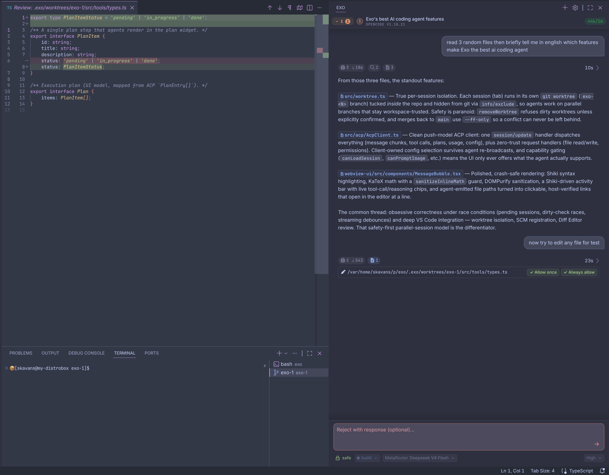

# Exo — AI Coding Agent Client for VS Code

<p align="center">
  
</p>

A local AI coding assistant interface that lives in your VS Code sidebar. Exo
connects to any [ACP](https://agentclientprotocol.com/get-started/introduction)-compatible
agent — [opencode](https://github.com/anomalyco/opencode) works out of the box,
others are on the roadmap — and gives you a clean, native interface for the
conversation.

Exo is not an agent. It is a **client**: it spawns your agent as a child process
(via stdio/ACP), renders the conversation in the sidebar, and handles the
agent's requests (file access, permissions, config, plans) with native VS Code
UX. The agent stays fully in control of its state, sessions, and history.

## Why?

Because reading and writing code is much better in a real editor than in a TUI:

- **Typography-first.** The whole UI is built around readable, syntax-highlighted
  markdown — nice fonts, proper text. Tool calls collapse into a single compact
  activity line, so you stay focused on the conversation, not the plumbing.
- Code you can actually look at: hover, jump-to-definition, search, multiline diffs.
- Every file edit the agent makes lands in a **real diff editor** you can inspect
  and approve before it happens — flip to YOLO auto-approve in one click whenever
  you want.
- When the agent references a file, Exo detects it and highlights it — one click
  opens it at the exact line.
- Every session works in its **own isolated git worktree** — your main branch
  stays clean no matter what the agent does, and results land in main with one
  click.

Everything the agent produces is rendered against the rest of your VS Code
workspace, not in an isolated terminal box.

## The story

I used to love Cline and KiloCode — until one was abandoned and the other was
ported to a new engine that turned it into something genuinely unpleasant to use.
Building an agent from scratch is a much bigger project (I did try), so I went
the other way: a **pure ACP client**. That turned out great, and this is the
result.

## Status

Works nearly perfectly with [opencode](https://github.com/anomalyco/opencode) out of the
box. Other ACP agents are on the roadmap — they should work, but expect rough
edges and report them.

## Features

- `/` slash-command picker + `@` file attachment (fuzzy-matched) + drag-drop of
  files and images, like the good old days.
- Two permission modes, flipped live with the Auto-Allow toggle in the input:
  - **default** — every agent permission request is shown for your review, with
    allow / reject / follow-up options;
  - **auto** — requests are auto-approved client-side (yolo mode).
- **Parallel sessions** — each tab is its own agent process, so you can run
  multiple agents at once and switch between them freely; sessions keep working
  in the background.
- **Isolated git worktree per session** — every new session spawns its agent in
  a fresh `exo-<N>` git worktree with its own branch, so your `main` is never
  touched. The worktree shows up in the Explorer and Source Control, each session
  gets its own `exo-<N>` terminal, and results land in `main` with a single
  **merge** click (commit + integrate + safe fast-forward, handled by the agent
  and the client together).
- A **session picker** in the header: jump between open sessions, reopen recent
  ones, or delete them — all in one menu.
- Automatic theming: the UI adapts to your current VS Code color theme. Some
  places it looks genuinely great, others may still need a tweak.
- Syntax highlighting via Shiki (bundled, no WASM, instant), KaTeX math, and a
  crash-safe message renderer.
- Persisted draft text and attached files across restarts; sessions are
  agent-owned and resumable.

## Getting started

Requirements: Node.js + npm, VS Code.

```sh
npm install
npm run compile        # one-shot build (extension + webview)
```

Then launch the extension host with F5 (`vscode:prepublish` runs automatically),
or build a `.vsix` and install it:

```sh
npm run install-local   # packages and installs the .vsix (no version bump)
npm run release -- patch # bump version, commit+tag, push + GitHub Release with auto-notes
```

Configure at least one ACP agent in `~/.config/exo/config.yml`
(`$XDG_CONFIG_HOME`, default `~/.config/exo`):

```yaml
# Exo configuration
agents:
  - id: opencode
    type: stdio
    command: opencode
    args: ["acp"]
```

Open the Exo sidebar, start a session, and talk.

## Development

```sh
npm run compile   # build extension (out/extension.js) + webview (out/webview.js)
npm run watch     # esbuild watch mode
npm run lint      # ESLint over src/ (webview is not linted)
```

Architecture notes, module map, protocol contracts and key abstractions live in
`AGENTS.md` at the repository root (the project Memory Bank).

## Direction

Exo is developed **exclusively in this paradigm** — a VS Code-first ACP
client. No pivots, no cloud, no hosted anything. The focus is:

- broader ACP protocol coverage and better agent compatibility;
- polishing the editor experience further.

The current state already satisfies my daily workflow, so development will be
steady, not frantic. **Pull requests that improve things within this paradigm are
welcome.**

## Support

If you like Exo, a tip is always appreciated:

| Asset | Address |
|---|---|
| **BTC** | `bc1qfwyp3xpd85la70eqaujnlmz947hs7zrqgn7uux` |
| **ETH** | `0xE77d7d538A2E53F474aB2d11081B69cb90b35E67` |
| **TON** | `UQApS03GSZ0s_0x5wghz9vygDA61GSAcSf-yZBgcjXge3oWe` |

## License

GPL-3.0
